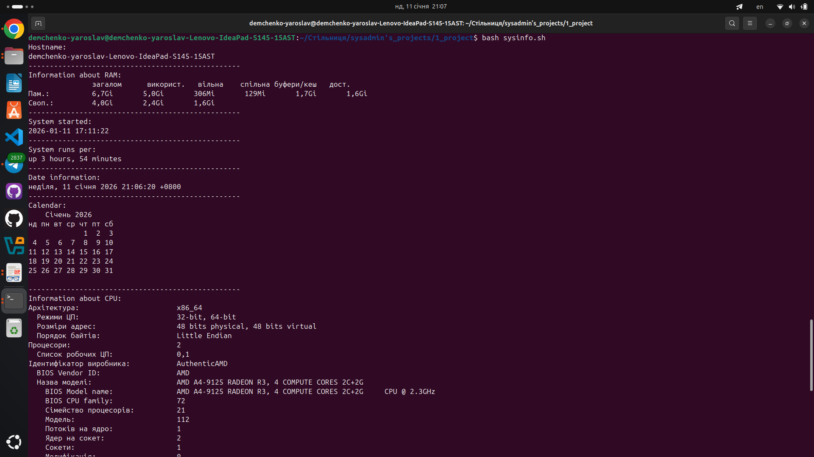

# sysinfo
DESCRIPTION:

System: Ubuntu 24.04

Goal: Created the sysinfo.sh file for view the system information about hostname CPU, RAM, uptime, date and calendar.

Technologies: Linux, Bash

Short Description: This script created for view selected information about system in bash terminal. Used bash commands. Used echo in script for visually friendly display structure the information.

SCREENSHOTS:


INSTALLATION AND RUN:

##Installation
```bash
git clone https://github.com/DemchenkoDev/sysinfo.git
cd sysinfo
npm install
```
##Run
```bash
./sysinfo.sh
```
or:
```bash
bash sysinfo.sh
```
or:
```bash
systemctl start sysinfo.sh
```
